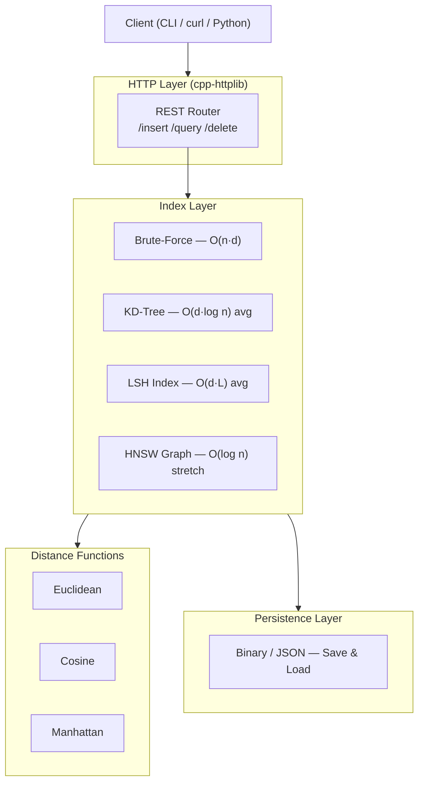

<div align="center">

# ⚡ VectoRex

### A from-scratch, high-performance vector similarity search engine in C++

[](https://en.cppreference.com/w/cpp/17)
[](https://cmake.org/)
[](LICENSE)
[]()

</div>

---

VectoRex is a ground-up implementation of a vector database built entirely in C++17 — no third-party vector search libraries, no shortcuts.  
It progresses from a brute-force baseline through KD-Trees, LSH-based approximate nearest neighbor search, a REST API, persistent storage, and (optionally) HNSW — the index powering Pinecone, Weaviate, and Qdrant in production.

---

## Table of Contents

- [Motivation](#motivation)
- [Architecture](#architecture)
- [Features by Phase](#features-by-phase)
- [Benchmarks](#benchmarks)
- [Build Instructions](#build-instructions)
- [Usage](#usage)
  - [CLI](#cli)
  - [REST API](#rest-api)
- [Folder Structure](#folder-structure)
- [Roadmap](#roadmap)
- [License](#license)

---

## Motivation

Modern vector databases (Pinecone, Weaviate, Qdrant, Milvus) are everywhere — powering semantic search, RAG pipelines, and recommendation systems. Most engineers use them as black boxes.

This project is about understanding what's actually inside:

- How do you measure similarity between high-dimensional vectors?
- When does exact search break down, and why does approximate search exist?
- What is Locality-Sensitive Hashing actually doing, geometrically?
- Why did HNSW replace tree-based indexes in production?

Building VectoRex from scratch answers all of these questions with running, benchmarked code.

---

## Architecture



---

## Features by Phase

| Phase | Feature | Status |
|-------|---------|--------|
| **0 — Foundation** | CMake project scaffold | 🔲 Planned |
| | Distance functions: Euclidean, Cosine, Manhattan | 🔲 Planned |
| | Unit tests (Google Test / Catch2) | 🔲 Planned |
| **1 — Exact NN** | Brute-force k-NN baseline | 🔲 Planned |
| | KD-Tree exact k-NN search | 🔲 Planned |
| | CLI tool: insert & query | 🔲 Planned |
| **2 — Approximate NN** | Locality-Sensitive Hashing (LSH) index | 🔲 Planned |
| | Configurable hash tables & hash functions | 🔲 Planned |
| | Recall@K vs. Query Latency benchmark | 🔲 Planned |
| **3 — Usable Vector DB** | Persistent index (save/load to disk) | 🔲 Planned |
| | HTTP REST API (insert, query, delete) | 🔲 Planned |
| | Callable via `curl` / Python | 🔲 Planned |
| **4 — HNSW (Stretch)** | HNSW graph index implementation | 🔲 Planned |
| | Three-way benchmark: KD-Tree vs. LSH vs. HNSW | 🔲 Planned |

---

## Benchmarks

The central artifact of Phase 2 is a **Recall@K vs. Query Latency** graph — the core tradeoff in approximate nearest neighbor search. LSH lets you tune that knob: more hash tables = higher recall, higher latency.


> _Graph populated once Phase 2 is complete._  
> X-axis: Query latency (ms) · Y-axis: Recall@10 (%) · One point per LSH config (varying `L` hash tables, `k` hash functions).

Phase 4 will extend this to a three-way comparison: KD-Tree (exact) vs. LSH (tunable ANN) vs. HNSW (state-of-the-art ANN).

---

## Build Instructions

**Prerequisites:**
- CMake ≥ 3.16
- C++17 compiler (GCC 9+, Clang 10+, MSVC 2019+)
- Phase 3+: [cpp-httplib](https://github.com/yhirose/cpp-httplib) and [nlohmann/json](https://github.com/nlohmann/json) — fetched via CMake FetchContent

```bash
git clone https://github.com/yourusername/VectoRex.git
cd VectoRex
mkdir build && cd build
cmake .. -DCMAKE_BUILD_TYPE=Release
make -j$(nproc)
```

**Run tests:**
```bash
ctest --output-on-failure
```

---

## Usage

### CLI

```bash
# Insert vectors (one per line: id f1 f2 f3 ... fd)
./vectorex insert --index my_index.bin --input vectors.txt --metric cosine

# Query k nearest neighbors
./vectorex query --index my_index.bin --vector "0.1 0.4 0.9 0.2" --k 5
```

**Output:**
```
Query: [0.1, 0.4, 0.9, 0.2]
Top-5 nearest neighbors:
  1. id=42   dist=0.0312
  2. id=108  dist=0.0487
  3. id=7    dist=0.0601
  4. id=55   dist=0.0714
  5. id=93   dist=0.0823
```

### REST API

```bash
# Start server
./vectorex-server --port 8080 --metric cosine

# Insert
curl -X POST http://localhost:8080/insert \
  -H "Content-Type: application/json" \
  -d '{"id": "doc_42", "vector": [0.1, 0.4, 0.9, 0.2]}'

# Query
curl -X POST http://localhost:8080/query \
  -H "Content-Type: application/json" \
  -d '{"vector": [0.1, 0.4, 0.9, 0.2], "k": 5}'

# Delete
curl -X DELETE http://localhost:8080/delete/doc_42
```

---

## Folder Structure

```
VectoRex/
├── CMakeLists.txt
├── README.md
├── docs/
│   └── benchmark.png           # Recall@K vs. Latency graph (Phase 2)
├── include/
│   ├── distance.h
│   ├── brute_force.h
│   ├── kd_tree.h
│   ├── lsh.h
│   ├── hnsw.h                  # Phase 4
│   ├── storage.h
│   └── server.h                # Phase 3
├── src/
│   ├── distance.cpp
│   ├── brute_force.cpp
│   ├── kd_tree.cpp
│   ├── lsh.cpp
│   ├── hnsw.cpp
│   ├── storage.cpp
│   ├── server.cpp
│   └── main.cpp
├── tests/
│   ├── test_distance.cpp
│   ├── test_brute_force.cpp
│   ├── test_kd_tree.cpp
│   └── test_lsh.cpp
└── benchmarks/
    ├── bench_recall.cpp
    └── bench_throughput.cpp
```

---

## Roadmap

- [ ] **Phase 0** — CMake scaffold, distance functions, unit tests
- [ ] **Phase 1** — KD-Tree exact k-NN, brute-force validator, CLI
- [ ] **Phase 2** — LSH approximate NN, benchmark graph
- [ ] **Phase 3** — Persistent storage, HTTP REST API
- [ ] **Phase 4 (Stretch)** — HNSW, three-way benchmark

**Future ideas:**
- SIMD-accelerated distance computation (AVX2/AVX-512)
- Filtered search (metadata predicates + vector similarity)
- Product quantization (PQ) for memory-efficient indexing
- Multi-threaded query serving

---

## License

MIT — see [LICENSE](LICENSE).

---

<div align="center">
Built from scratch to understand how vector search actually works.
</div>
